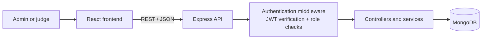

<p align="center">
  
</p>

<h1 align="center">GradeWise</h1>

<p align="center">
  A role-based platform for managing project exhibitions, assigning judges, and collecting structured project evaluations.
</p>

<p align="center">
  
  
  
  
</p>

---

## Overview

GradeWise is a full-stack project for managing project exhibitions and competitions. It supports two distinct roles:

- **Judges** review assigned projects, configure preferences, and submit structured grades.
- **Administrators** manage users and projects, assign judges, monitor grades, view analytics, and generate a podium.

The application combines a React single-page frontend with an Express API and MongoDB persistence layer.

## Highlights

- Role-based admin and judge dashboards
- JWT authentication with backend route authorization
- Project-to-judge assignment workflow
- Structured grading across complexity, usability, innovation, presentation, and proficiency
- Duplicate-grade protection using a compound MongoDB index
- CSV import for projects and potential users
- Grade management, analytics, export, and podium views
- Persistent light/dark theme preference

## Problem and solution

Project exhibitions need a reliable way to coordinate projects, judges, assignments, and consistent evaluation criteria. GradeWise replaces fragmented spreadsheets and manual follow-up with a single role-based workflow:

- Administrators manage the exhibition data and judge assignments.
- Judges see only the projects assigned to them and submit structured evaluations.
- The system keeps grades tied to a specific judge and project, making the results traceable and preventing duplicate submissions.
- Analytics and podium views turn collected grades into useful decision-making information.

## Architecture



### Authentication flow

```text
Login credentials
  → Express controller validates credentials
  → bcrypt verifies the stored password hash
  → server signs a JWT containing safe user claims
  → frontend stores the token and restores the session on startup
  → protected API routes verify the token and authorize the user role
```

## Tech stack

| Area | Technologies |
| --- | --- |
| Frontend | React 18, React Router, MobX, Styled Components, MUI, SweetAlert2 |
| Backend | Node.js, Express, JWT, bcryptjs, CORS |
| Database | MongoDB, Mongoose |
| Data and UI | CSV import, Chart.js, Axios, FileSaver |
| Deployment | Docker and Nginx configuration |

## Repository structure

```text
GradeWise/
├── mta-final-projects-site/                 # React frontend
│   ├── public/
│   └── src/
│       ├── users/                            # Admin and judge pages
│       ├── stores/                           # MobX shared state
│       ├── context/                          # Theme context
│       └── utils/                            # Shared UI/utilities
├── mta-final-projects-site-backend-server/  # Express backend
│   ├── controllers/                          # HTTP request handlers
│   ├── services/                             # Business logic
│   ├── middleware/                           # JWT authentication/authorization
│   ├── DB/entities/                          # Mongoose schemas/models
│   └── Routers/                              # API route definitions
└── README.md
```

## Core workflows

### Administrator

1. Import and manage projects and potential judges.
2. Assign projects to judges while preventing duplicate assignments.
3. Monitor submitted grades, export data, review analytics, and present a podium.

### Judge

1. Log in and configure judging preferences/profile data.
2. View assigned projects.
3. Submit or update a structured evaluation and optional comment for each project.

## Backend design notes

- **Controllers** handle HTTP request/response concerns.
- **Services** own business logic such as login validation and registration.
- **Middleware** verifies JWTs and enforces admin/judge role permissions before protected handlers run.
- **Mongoose models** define the MongoDB data shape for users, projects, grades, and assignments.
- The grade schema uses a unique `{ judge_id, project_id }` index to ensure one judge cannot submit duplicate grades for the same project.

